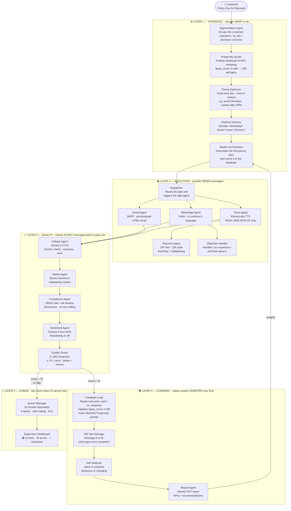
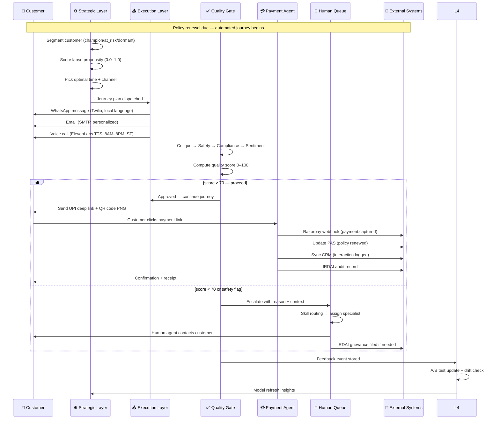
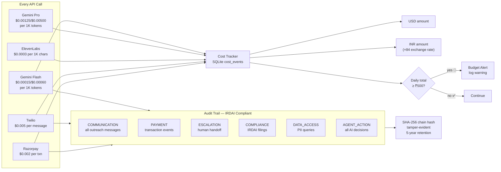
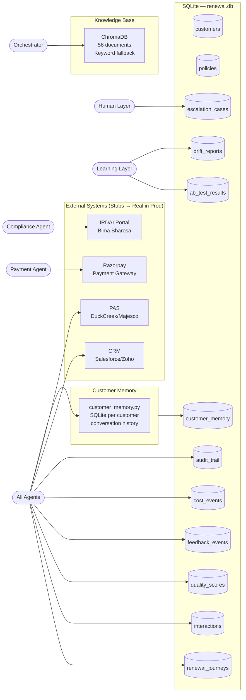
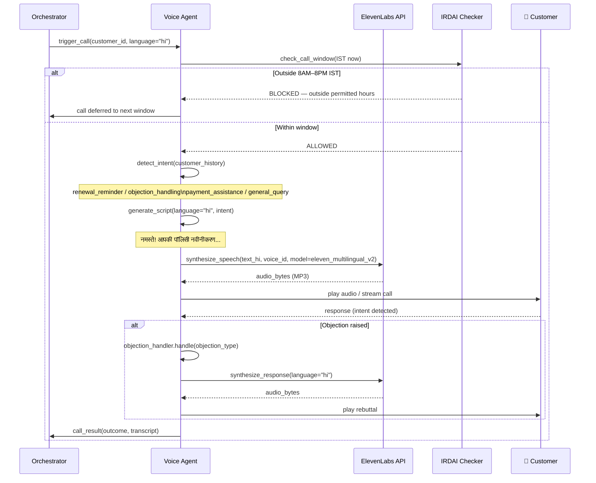
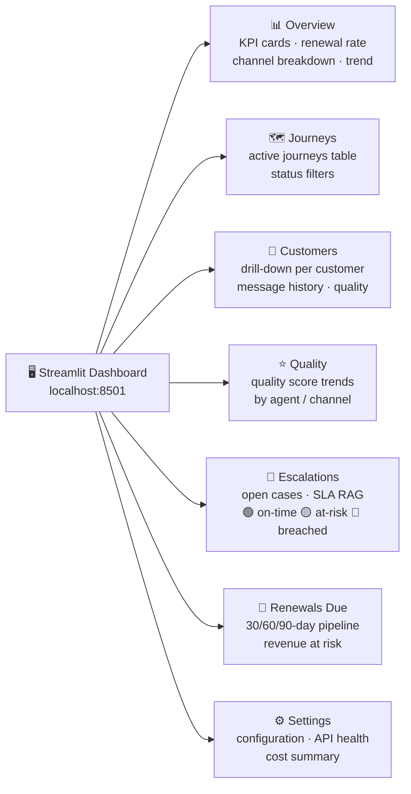
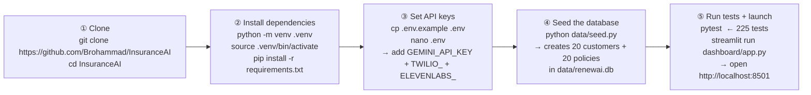

# 🔄 Project RenewAI — Workflow Guide

> **Who is this for?**
> This document is written for someone reading this codebase for the **first time**.
> It explains **what the system does**, **why each part exists**, and **how everything connects** — using plain English followed by visual diagrams.

---

## 📖 The Big Picture (Read This First)

Suraksha Life Insurance has thousands of customers whose life insurance policies are about to expire (called **"renewal due"**). Without renewal, the customer loses their coverage and the company loses revenue.

The old process: a human agent manually calls each customer. This doesn't scale.

**Project RenewAI** replaces that with an AI system that:
1. Figures out **which customers are most at risk** of not renewing
2. **Automatically contacts** them via WhatsApp, Email, or Voice call — in their own language
3. **Handles objections**, sends payment links, and processes payments
4. **Checks quality** of every message before sending
5. **Learns** from outcomes to get better over time
6. **Escalates** to a human only when truly needed

The system is built as **21 AI agents** grouped into **5 layers**, each with a specific job.

---

## 1. The 5-Layer Architecture

> **What you're looking at:** The complete system from top to bottom. Each box is an AI agent. The arrows show the order things happen.



---

## 2. A Customer's Journey — Step by Step

> **What you're looking at:** A sequence diagram traces one customer's journey through the entire system. Time flows **downward**. Each horizontal arrow is one action. Read it like a script.



---

## 3. Payment Flow — How a Customer Pays

> **What you're looking at:** All the payment options the system can offer a customer. Every path eventually leads to Razorpay confirming the payment and the policy getting marked as renewed.


---

## 4. Human Escalation — Who Gets the Case

> **What you're looking at:** Not every case can be handled by AI. When a quality check fails, a customer is distressed, or a payment fails, the case goes to a human. This diagram shows exactly how the right specialist is picked.


---

## 5. Quality Gate — Every Message Gets Checked

> **What you're looking at:** Before ANY message leaves the system, it passes through 5 checks in sequence. Think of it as airport security — one failed check and the message doesn't go out. Score ≥ 70 = approved. Score < 70 = blocked and escalated to a human.


---

## 6. Observability — Tracking Cost and Compliance

> **What you're looking at:** Every single API call does two things automatically: (1) logs its cost so we don't overspend, and (2) writes a tamper-evident audit entry for IRDAI compliance. Both happen without any agent needing to think about it.



---

## 7. The Closed Feedback Loop — How the AI Gets Smarter

> **What you're looking at:** This is what separates RenewAI from a static rule-based system. After enough real-world outcomes accumulate (customers paid or lapsed), the Propensity Agent's Gemini prompt is **automatically updated** with those real examples. The next scoring run is therefore more accurate — no retraining, no manual work.


---

## 8. Data — What's Stored and Where

> **What you're looking at:** All data lives in a single SQLite file (`data/renewai.db`). This diagram shows which tables exist, which layer writes to each one, and which external systems also get updated when actions happen.



---

## 9. Voice Call — Language + IRDAI Compliance

> **What you're looking at:** A voice call is the most complex channel. It must first check whether calling is even legally allowed right now (IRDAI: 8AM–8PM IST only), then detect what the customer needs, generate a script in their language, and handle any objections — all in real time.



---

## 10. Admin Dashboard — 7 Pages

> **What you're looking at:** The Streamlit dashboard that a business analyst or ops manager uses daily to monitor the system. Run it with `streamlit run dashboard/app.py` then open `http://localhost:8501`.



---

## 11. The Closed Feedback Loop — System Gets Smarter Over Time

> **What you're looking at:** This is the self-improvement engine. Every time a customer **pays** or **lapses**, the system records the outcome, and the `FeedbackLoopAgent` uses those real outcomes to rewrite the examples it gives to the `PropensityAgent`. The next batch of customers gets scored using a prompt that reflects what actually happened — not just what was assumed at training time.

```mermaid
flowchart TD
    A([Customer Outcome\nrecorded in DB\npaid / no_response / escalated]) --> B[FeedbackLoopAgent.run\ncollects outcomes from\nfeedback_events table]

    B --> C{≥ 10 strong-signal\nevents collected?}

    C -- No --> D[Skip refresh\nuse existing prompt]
    C -- Yes --> E[PropensityAgent.refresh_from_feedback\nreads top 5 PAID + top 5 LAPSED\nfrom real outcomes]

    E --> F[Builds few-shot block\ne.g. age=42 · city=Mumbai · score=0.87 → PAID\nage=58 · city=Pune · score=0.21 → LAPSED]

    F --> G[Stores in module cache\n_FEEDBACK_FEW_SHOT]

    G --> H[Next call to PropensityAgent.run\ninjects few-shot block at top of\nGemini prompt automatically]

    H --> I([Gemini sees real past examples\nbefore scoring the new customer\n→ more accurate lapse_score])

    I --> J[FeedbackSummary returned\n• events_processed\n• score_updates\n• propensity_prompt_refreshed = True])
```

**Key files:**
| File | What it does |
|------|-------------|
| `agents/layer1_strategic/propensity.py` | Holds `refresh_from_feedback()` + `_FEEDBACK_FEW_SHOT` cache |
| `agents/layer4_learning/feedback_loop.py` | Auto-triggers refresh when threshold is met |
| `agents/layer1_strategic/orchestrator.py` | `run_batch_with_feedback()` — run a batch + auto-learn |
| `tests/test_feedback_propensity_loop.py` | 7 tests covering the full loop |

---

## 12. Quick-Start — Run the System in 5 Steps

> **What you're looking at:** The exact commands to go from a fresh clone to a running system. Copy-paste these in order.



**Optional extras:**
```bash
# Run only end-to-end tests (hits real Gemini API — costs tokens):
pytest -m e2e

# Run a single batch with automatic feedback learning:
python -c "
from agents.layer1_strategic.orchestrator import run_batch_with_feedback
# pass list of (Customer, Policy) tuples
result = run_batch_with_feedback(pairs)
print(result['feedback'])
"
```

---

## 13. Glossary

> **First-time reader?** Here are all the terms used in this document and the codebase.

| Term | What it means |
|------|---------------|
| **lapse_score** | A number from 0 to 100 that estimates how likely a customer is to NOT renew. 0 = almost certain to renew. 100 = almost certain to lapse. Computed by the Propensity Agent using Gemini. |
| **champion** | A customer segment. Champions renew on time, have high NPS, and rarely need nudging. |
| **at_risk** | A customer segment. These customers missed past payments or showed price sensitivity. High priority for the system. |
| **dormant** | A customer segment. No engagement for 6+ months. The system tries to re-activate them. |
| **churned** | A customer segment. Already lapsed. System attempts win-back with a special offer. |
| **IRDAI** | Insurance Regulatory and Development Authority of India. The government body that sets rules for insurance. The system enforces IRDAI call hours (8 AM–8 PM IST) and disclosure requirements automatically. |
| **PAS** | Policy Administration System. The core database that stores policy records for an insurance company. The system integrates with it via a stub (`integrations/pas_stub.py`). |
| **CRM** | Customer Relationship Management system. Stores customer contact history. The system pushes journey updates to it via a stub (`integrations/crm_stub.py`). |
| **UPI** | Unified Payments Interface. India's real-time payment system (PhonePe, GPay, Paytm). The Payment Agent generates UPI deep-links and QR codes. |
| **NACH** | National Automated Clearing House. India's system for recurring auto-debit mandates. Used for AutoPay renewals. |
| **TTS** | Text-to-Speech. The Voice Agent uses ElevenLabs TTS to synthesize audio in the customer's language. |
| **RAG** | Retrieval-Augmented Generation. The Knowledge Base layer — agents look up product docs and FAQs before generating answers, so Gemini doesn't hallucinate policy details. |
| **few-shot** | A prompting technique where you give the AI 2–5 real examples before asking it to do a task. The feedback loop builds a few-shot block from real paid/lapsed outcomes. |
| **SLA** | Service Level Agreement. The maximum time allowed to resolve an escalated case. The Queue Manager tracks 🟢 on-time / 🟡 at-risk / 🔴 breached. |
| **drift** | When customer behaviour starts changing in ways the model wasn't trained for. The Drift Detector alerts ops when this happens. |
| **A/B test** | Sending message variant A to half the customers and variant B to the other half, then measuring which gets more renewals. |
| **stub** | A placeholder integration that mimics a real external system (CRM, PAS, payment gateway) without actually calling it. Stubs live in `integrations/`. |
| **Gemini** | Google's large language model (LLM), specifically `gemini-2.5-pro` and `gemini-2.5-flash`. The AI brain behind all content generation and scoring. |

---

*Project RenewAI · Suraksha Life Insurance · 21 Agents · 5 Layers · 225 Tests*
*All Mermaid diagrams render natively on GitHub and in VS Code with the Mermaid Preview extension.*
