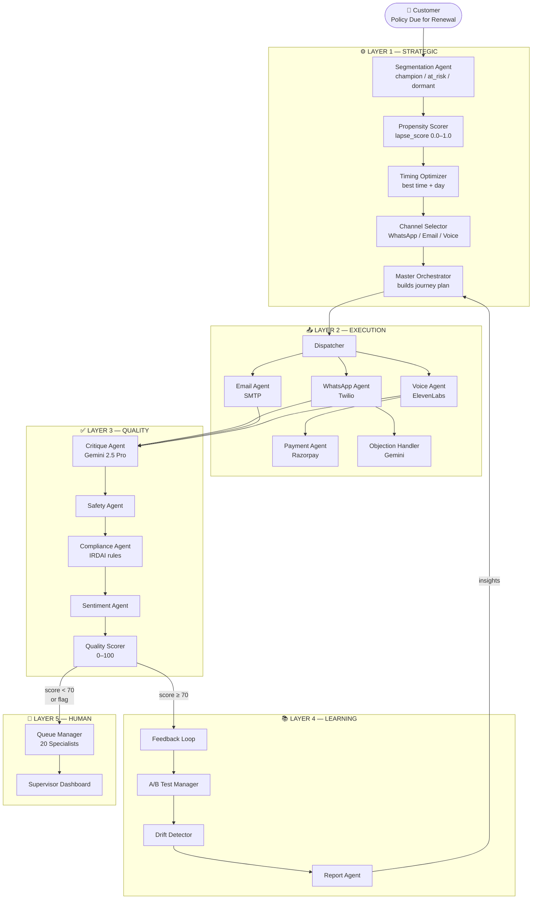
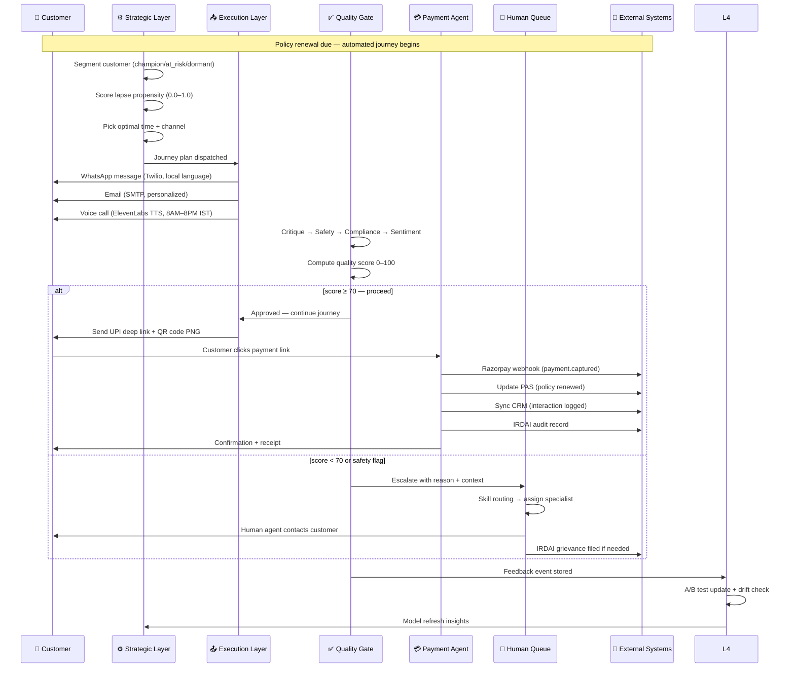
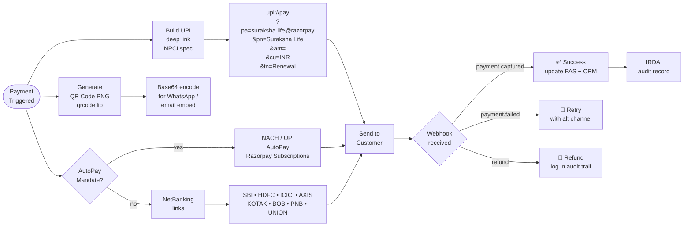
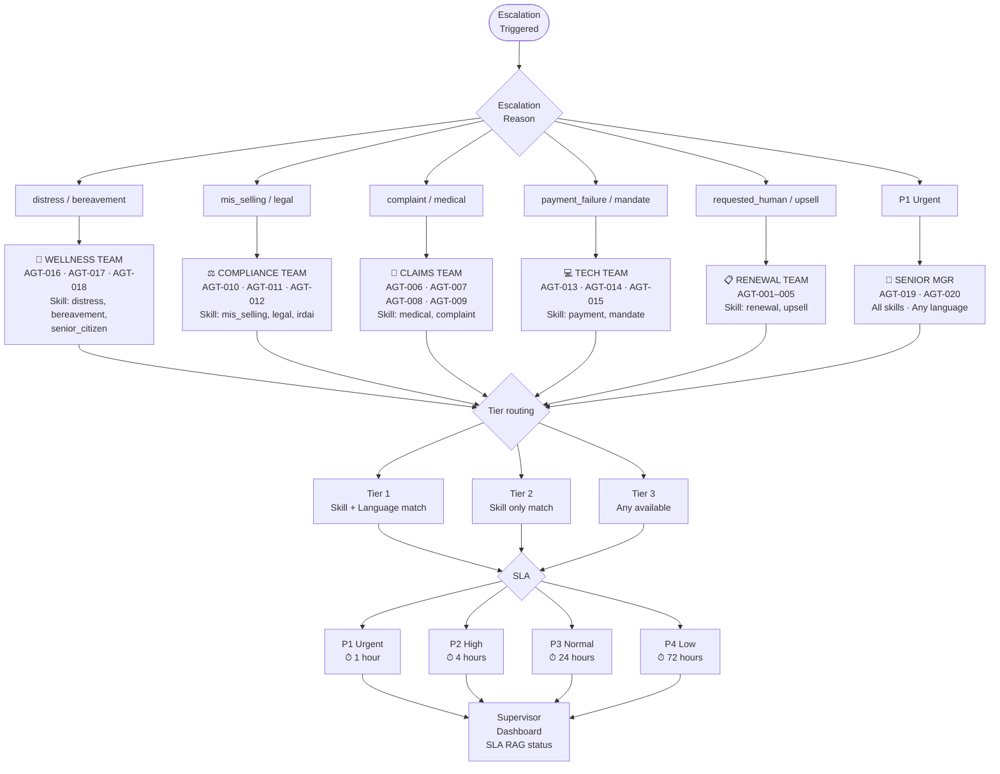
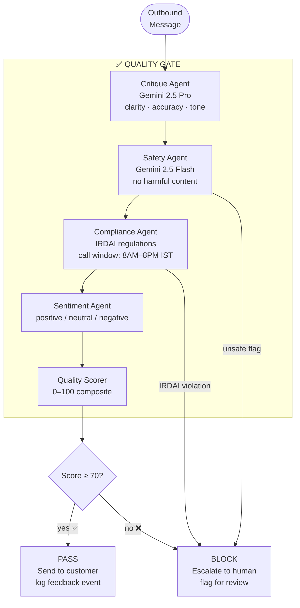
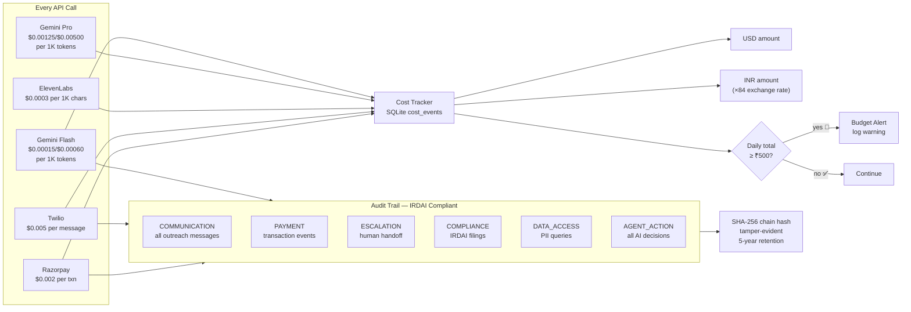
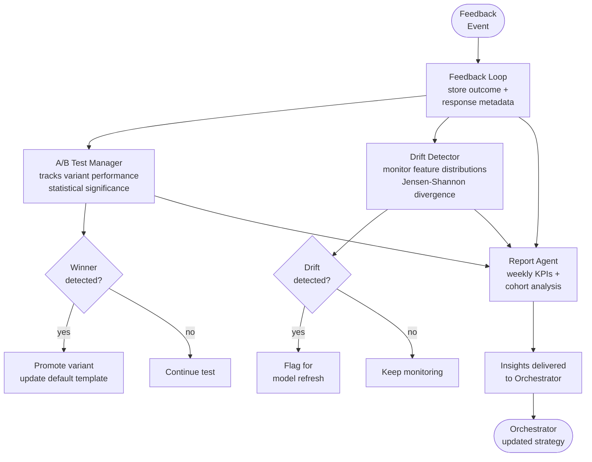
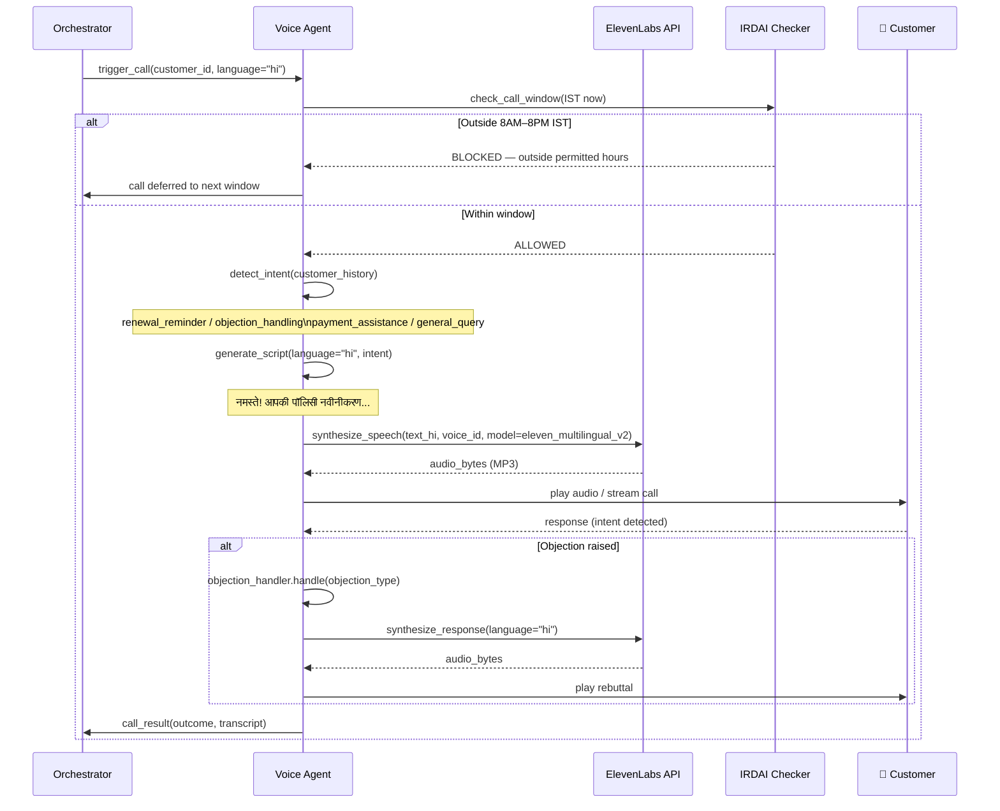
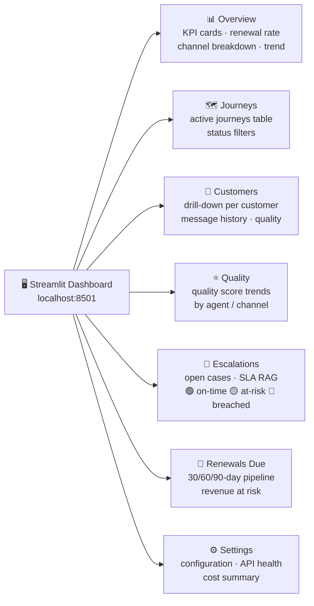

# 🔄 Project RenewAI — Complete Workflow Diagrams

> Detailed flow diagrams for every subsystem of the 21-agent insurance renewal platform.

---

## 1. End-to-End System Architecture

---

## 2. Customer Renewal Journey — Sequence Diagram

---

## 3. Payment Processing Flow

---

## 4. Human Escalation & Skill Routing

---

## 5. Quality Gate — Layer 3 Detail

---

## 6. Observability & Cost Tracking

---

## 7. Layer 4 — Learning & Adaptation Loop

---

## 8. Data Flow — Databases & Integrations

---

## 9. Multi-Language Voice Call Flow

---

## 10. Admin Dashboard — Pages Overview

---

*Project RenewAI · Suraksha Life Insurance · All diagrams render in GitHub · VS Code Mermaid Preview*
